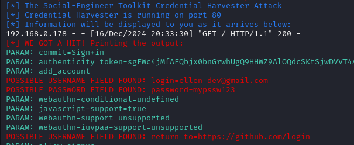

<div align="center">

# Phishing para captura de senhas do Github. 🎣

# ⚠ Aviso:

Este é um projeto proposto por **Cassiano**, professor na **DIO** (escola de educação tecnológica). No repositório dele, o título era "Facebook", pois a proposta inicial era criar a página de login do Facebook. No entanto, por algum motivo, eu não consegui concluir a atividade como foi proposto, então optei pelo **GitHub** como exemplo.  
👉 Este projeto é **apenas para fins educacionais**! Fiquem à vontade para prosseguir.

</div>

# 👀 O que é "Phishing"?

**Phishing** é um termo derivado de palavras combinadas em inglês: *"fishing"* (pesca) e as letras *"ph"*, que substituem o "f" da palavra *"password"* (senha).  
A ideia desse termo é uma **metáfora** com a pesca: assim como o pescador lança um anzol para pescar um peixe, o criminoso/golpista lança uma "isca" para a vítima a fim de **"pescar"** — ou seja, induzir a vítima a cair em um erro e capturar dados sensíveis.

### 🛑 Como Funciona o Phishing?

Phishing é um **crime digital** simples, mas extremamente eficaz. Ele visa capturar dados sensíveis da vítima, como:

- Número de **cartão de crédito**
- **Dados bancários**
- **Informações pessoais** (nome, endereço, telefone, etc.)
- **E-mails** e **senhas**
- Acessos a **dispositivos** ou até mesmo a uma **organização**

Os **golpes** podem ser direcionados a uma pessoa ou a um grupo de pessoas, frequentemente através de:

- **E-mail**
- **Telefone**
- **Mensagem de texto**

Além disso, os golpistas costumam utilizar **links falsos** que imitam páginas legítimas (como o nosso projeto, embora sejam mais elaborados). Eles podem criar um site de login de um banco, por exemplo, para enganar a vítima. Em muitos casos, eles se passam por uma **autoridade** ou por alguém de confiança da vítima. Um e-mail se passando por uma autoridade, contendo **download** de um software em beta, com anexos, como um PDF, etc.

### 🎯 O Impacto do Phishing

Esses ataques não se limitam ao mundo virtual. O phishing também explora aspectos emocionais e de manipulação, tornando-se um golpe que pode atingir diretamente empresas ou até envolver interações físicas. Embora muitas vezes os golpistas se aproveitem da vulnerabilidade virtual, em alguns casos, o ataque é **presencial**, com golpistas indo até o local da vítima.

### 🔍 Tipos de Phishing

Existem vários tipos de phishing, incluindo:

1. **Phishing por e-mail**: O mais comum, onde o golpista envia e-mails falsos solicitando informações confidenciais.
2. **Spear Phishing**: Ataques direcionados a uma pessoa ou organização específica, com informações personalizadas para aumentar a credibilidade.
3. **Vishing**: Phishing realizado via telefone, onde o golpista tenta obter informações diretamente do alvo.
4. **Smishing**: Phishing via mensagem de texto (SMS), muitas vezes com links maliciosos.
5. **Whaling**: Um tipo de phishing direcionado a executivos de alto nível ou pessoas com acesso a informações valiosas dentro de uma organização.

### 🚨 Conclusão:

> **Phishing** é um crime digital simples, mas extremamente eficaz e com grande impacto, tanto no mundo virtual quanto no físico, que visa capturar dados sensíveis da vítima ou obter acesso a a contas, sistemas ou informações privadas. Ele é um conjunto de várias técnicas que está sempre em evolução, sendo uma das ameaças mais crescentes globalmente. Portanto, as equipes de segurança precisam estar atentas a essas mudanças e trabalhar para **conscientizar** as pessoas sobre os riscos envolvidos.

<div align="center">

# 💡 Exemplo de Phishing com Site Cloner:

</div>

### 🛠 Ferramentas:

- **Kali Linux**: Utilizado em uma máquina virtual, se preferir.
- **SET (Social Engineering Toolkit)**: Um conjunto de ferramentas poderosas, já disponível no Kali Linux, para simulações de ataques de engenharia social.

### ⚙ Configurando o Phishing no Kali Linux:

Primeiramente, se você estiver usando uma máquina virtual, precisará se conectar à sua rede. Antes de iniciar a máquina virtual, acesse as configurações e selecione a opção **'Rede'**. Em seguida, clique em 'Conectado a'. Provavelmente, estará em modo **'NAT'**. Escolha a opção **'Placa em modo Bridge'**. Agora, o seu Kali estará conectado à sua rede e poderá se comunicar com outros dispositivos.

Abra o terminal e siga o passo a passo abaixo:

- Acesso root: ``` sudo su ```
- Obtendo o endereço da máquina: ``` ifconfig ```
- Iniciando o **SEToolkit**: ``` setoolkit ```
- Tipo de ataque: ``` Social-Engineering Attacks ```
- Vetor de ataque: ``` Web Site Attack Vectors ```
- Método de ataque: ``` Credential Harvester Attack Method ```
- Método de ataque: ``` Site Cloner ```
- URL para clonar: http://github.com/login

Agora, basta copiar o **IP** da sua máquina Kali e acessar de qualquer dispositivo da sua casa. Após inserir as credenciais (fictícias ou não), você será redirecionado para o site oficial com **HTTPS** (HyperText Transfer Protocol Secure).  

> 🔒 O **HTTPS** é a versão segura do **HTTP**, que utiliza **criptografia** para proteger os dados. O "S" no final indica justamente essa camada adicional de segurança, tornando a comunicação protegida e confiável. Essa é a importância do protocolo **HTTPS**.


<div align="center">

# 🖥 Resutados

### 🎯 PC do alvo:


### 👨‍💻 PC do golpista:



</div>
